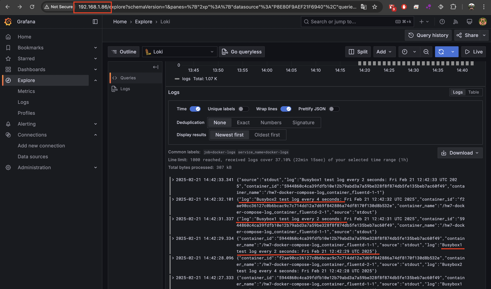

# HW7: Макет системи логування за допомогою docker compose


## Налаштування
### 1. Файл `.gitignore`
Проєкт містить файл `.gitignore`, у якому додатково вказано `.env`, щоб приховати змінні середовища.

### 2. Створено власну мережу типу bridge
Використовується **hw7-network**, яка визначена у `docker-compose.yml` як `driver: bridge`.

## Сервіси у `docker-compose.yml`

### **1. Grafana**
- Використовує офіційний образ `grafana/grafana`.
- Відкриває порт `80`, перенаправлений на внутрішній порт `3000`.
- Змінні середовища передаються через `.env`.
- Залежить від сервісу Loki.

### **2. Loki**
- Використовує офіційний образ `grafana/loki:latest`.
- Відкриває порт `3100` для отримання логів.
- Включено у мережу `hw7-network`.

### **3. Fluentd**
- Будується із власного `Dockerfile` у папці `fluentd-loki`.
- Працює з конфігурацією `fluentd.conf`.
- Відкриває порти `24224/tcp` та `24224/udp` для прийому логів.
- Залежить від Loki.

### **4. Логуючі контейнери (Busybox)**
- Два контейнера `busybox` генерують тестові логи.
- Логи пересилаються через Fluentd до Loki.
- Логи зберігаються з тегом `log_container_fluentd.logs`.

## Запуск проєкту
1. **Створити файл `.env`** та вказати змінні:
   ```sh
   GF_SECURITY_ADMIN_PASSWORD=admin
   GF_DASHBOARD_DEFAULT_HOME_DASHBOARD_PATH=/etc/grafana/dashboards/default-dashboard.json
   GF_SERVER_ROOT_URL=http://localhost:3000
   ```
2. **Запустити `docker-compose`**:
   ```sh
   sudo docker-compose up -d
   ```
3. **Перевірити запущені контейнери**:
   ```sh
   sudo docker ps
   ```

   **Результат:**:
   ```sh
   NAME                                           IMAGE                             COMMAND                  SERVICE                   CREATED          STATUS          PORTS
hw7-docker-compose-fluentd-loki-1              hw7-docker-compose-fluentd-loki   "tini -- /bin/entryp…"   fluentd-loki              15 minutes ago   Up 15 minutes   5140/tcp, 0.0.0.0:24224->24224/tcp, 0.0.0.0:24224->24224/udp, :::24224->24224/tcp, :::24224->24224/udp
hw7-docker-compose-grafana-1                   grafana/grafana                   "/run.sh"                grafana                   15 minutes ago   Up 15 minutes   0.0.0.0:80->3000/tcp, [::]:80->3000/tcp
hw7-docker-compose-hw7-loki-1                  grafana/loki:latest               "/usr/bin/loki -conf…"   hw7-loki                  15 minutes ago   Up 15 minutes   0.0.0.0:3100->3100/tcp, :::3100->3100/tcp
hw7-docker-compose-log_container_fluentd-1-1   busybox                           "sh -c 'while true; …"   log_container_fluentd-1   15 minutes ago   Up 15 minutes   
hw7-docker-compose-log_container_fluentd-2-1   busybox                           "sh -c 'while true; …"   log_container_fluentd-2   15 minutes ago   Up 15 minutes   
   ```

## Доступ до графани 
- **За допомогою інтерфейсу NAT мережі**: `http://localhost/`
- **За допомогою мережевого інтерфейсу типу bridge**: `http://192.168.1.86/`

## Зупинка проєкту
```sh
sudo docker-compose down
```

## Результат роботи Grafana

